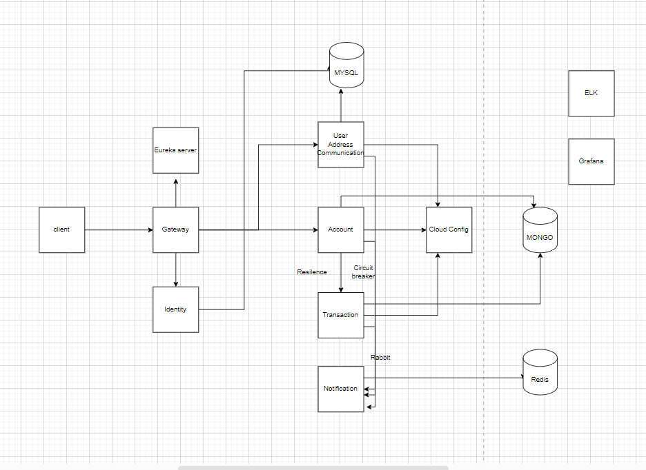

# **Core banking microservice application**


### **Technology**
*   Java 17
*    Spring Boot 3.0.5
*    Maven 3.9.1


## Architecture

1. user-service
2. account-service
3. notification-service
4. transaction-service
5. api-gateway
6. service-registry
7. identity-service
8. cloud config

---

---
| Tables               | Are  | to-do |
|----------------------|:----:|------:|
| service-registry     | 8761 |       |
| api-gateway          | 8080 |       |
| user-service         | 8081 |       |
| identity-gateway     | 8082 |       |
| account-service      | 8086 |       |
| notification-service | 8088 |       |
| transaction-service  | 8087 |       |
| config server        | 8888 |       |  

---

## Steps to Setup

1. Clone the application

    ```git clone https://writetoyoges@bitbucket.org/banking-poc/core-banking.git```
2. build the project

    ```mvn clean package```
3. build docker images

   ```docker-compose build```
4. start the container

    ```docker-compose up```
5. to stop the container
   
    ```docker-compose down```


## Explore Rest APIs
[Postman Collection
](https://github.com/nagarro-poc/core-banking/blob/bd36cdaece3e806c9ad6795fc0959f03889c5377/postman)https://github.com/nagarro-poc/core-banking/blob/bd36cdaece3e806c9ad6795fc0959f03889c5377/postman
